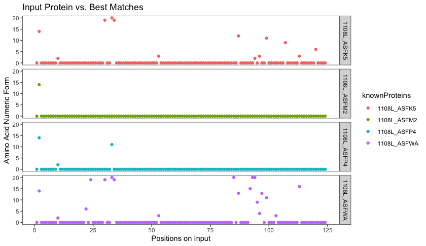

<!-- README.md is generated from README.Rmd. Please edit that file -->

```{r, include = FALSE}
knitr::opts_chunk$set(
  collapse = TRUE,
  comment = "#>",
  fig.path = "man/figures/README-",
  out.width = "100%"
)
```

# mutVis

<!-- badges: start -->
<!-- badges: end -->

The goal of mutVis is to compare the sequence of an unknown or mutated protein with a set of known protein sequences, find the best matched ones, and plot the amino acid differences on a graph.

## Installation

You can install the released version of mutVis from [GitHub](https://github.com) with:

``` {r eval=FALSE}
# install.packages("devtools")
library(devtools)
require("devtools")
devtools::install_github("angelawong1526/mutVis", build_vignettes = TRUE)
library("mutVis")
```
To run the shinyApp:
```{r eval=FALSE}
runMutVisApp()
```

## Overview

```{r eval=FALSE}
browseVignettes("mutVis")
data(package = "mutVis")
ls("package:mutVis")
```

This package contains 6 functions to analyze and compare the input protein sequence with known protein sequences and to find the best matches with the input protein. The results are visualized on a scatter plot. There is one function available for the users:

`matchProt()`: The main plotting function. This function generates a scatter plot with all the amino acid differences found in known protein sequences. The amino acids are represented on the x-axis in numerical form; they follow the order of "A, G, I, L, P, V, F, W, Y, D, E, R, H, K, S, T, C, M, N, Q", represented by number 1 through 20 (1 being "A" and 20 being "Q"). The amino acids have been ordered according to their properties. The first 6 are aliphatic, the next 3 are aromatic, the following 2 are acidic, the 12th to 14th are basic, 15 and 16 are hydroxylic, 17 and 18 are sulfur-containing, and the last 2 are amidic.
```{r eval=FALSE}
unknownProt <- "MAVLILVLLAVVILQAAPIRKLEDLLPTRYPPDHELVYWCTYANQCDFCWECVHGICRNRIQADWPVIHQNDWIINCTVSRWNGICSYYEGPRNHTDHQMDCANPTSHTYPHREYMKIYERDDL"
minPercent <- 80
result <- matchProt(unknownProt, minMatch = minPercent)
result
```


## Contributions

```{r eval=FALSE}
library("mutVis")
lsf.str("package:mutVis")
```

The author of the package is Angela Wong. 

The package uses functions from `seqinr`, `utils`, `reshape`, `shiny`, and `ggplot2`.
- `matchedProteins` uses `getName()` and `getSequence.SequenceAA()` from `seqinr`. This function is not available to the users.
- The dataset was generated using `read.fasta()` from `seqinr`

## References

Charif, D. and Lobry, J.R. (2007). seqinr. https://cran.r-project.org/web/packages/seqinr/index.html

R Core Team (2020). R: A language and environment for statistical computing. R Foundation for Statistical Computing, Vienna, Austria. https://www.R-project.org/

Wickham, H. (2007). Reshaping data with the reshape package. Journal of Statistical Software, 21(12). http://www.jstatsoft.org/v21/i12/paper

Wickham, H. (2016). ggplot2: Elegant Graphics for Data Analysis. Springer-Verlag New York. https://ggplot2.tidyverse.org

Wickham, H. and Bryan, J. (2019). R Packages (2nd edition). Newton, Massachusetts: O’Reilly Media. https://r-pkgs.org/

Winston Chang, Joe Cheng, JJ Allaire, Yihui Xie and Jonathan McPherson (2020). shiny: Web Application Framework for R. R package version 1.5.0. https://CRAN.R-project.org/package=shiny

Wong, A (2020). mutVis. R. Retrieved from https://github.com/angelawong1526/mutVis.

## Acknowledgements

This package was developed as part of an assessment for 2020 BCB410H: Applied Bioinformatics, University of Toronto, Toronto, CANADA.
